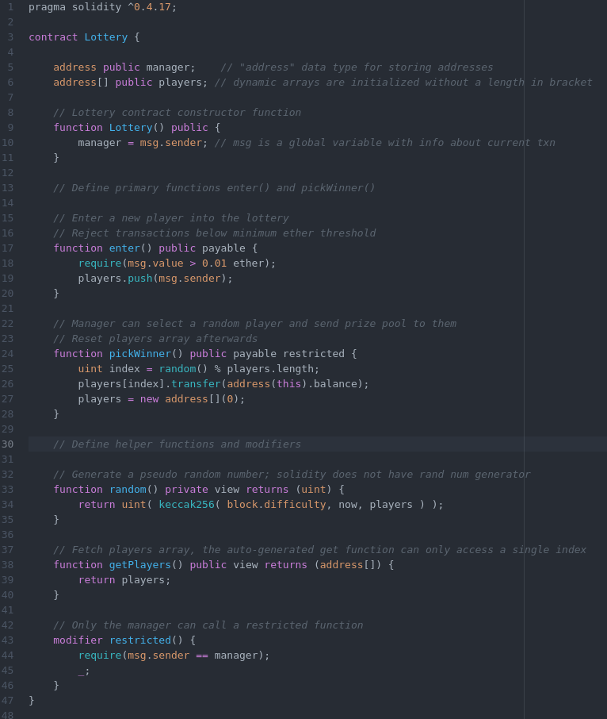
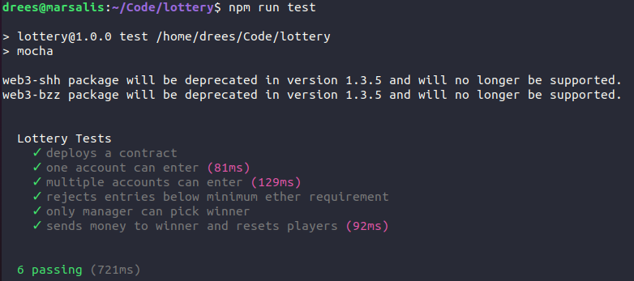

# Lottery Contract

Players enter into a lottery contract by submitting ETH to the contract prize pool. The manager of the lottery can have the lottery contract select a random player and send the prize pool to them. Afterwards, the lottery prize pool is reset and all of the players are exited from the contract.

## Variables

| Name    | Purpose                                       |
| ------- | --------------------------------------------- |
| Manager | Address of person who created the contract    |
| Players | Array of addresses of people who have entered |

## Main Functions

| Name        | Purpose                                               |
| ----------- | ----------------------------------------------------- |
| enter       | Enters a player into the lottery                      |
| pickWinner  | Randomly picks a winner and sends them the prize pool |

## Lottery contract

## Tests

Use `$ npm run test` from the project directory to run tests scripted in `test/lottery_test.js` with `mocha`.

